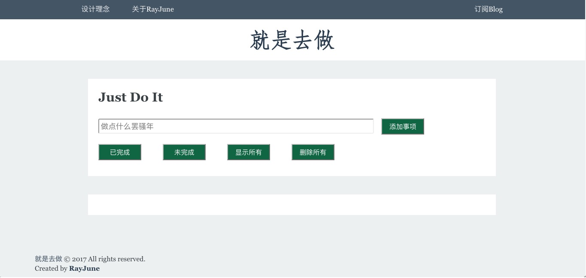

## 一个基于indexDB的、纯JS实现的toDoList web-app

### 颜值担当

### 功能完成进度

- [x] 基本页面搭建，CSS布局（使用flexbox，float，position进行布局，样式参考前端观察）
- [x] 实现添加事项功能，并自动获得当前日期
- [x] 实现删除所有事项功能
- [x] 将数据保存在indexDB中，并通过indexDB来进行增删改查找
- [x] 实现已完成、未完成、显示所有功能
- [ ] 实现点击li最右边的"x"来删除当前条功能
- [ ] 在侧边建立一个小日历，并可以通过日历来查询事件
- [ ] 针对手机的响应式页面（flexbox布局）

### 页面设计理念

整体样式模仿于[前端观察](https://www.qianduan.net)

### 感谢

* [Garrik-Liu的todolist](https://github.com/Garrik-Liu/practises-web/tree/master/cases/12.toDoList)
* [Liugq5713的todolist](https://github.com/Liugq5713/Todolist)

参考/模仿了不少代码，向两位表示感谢：）

