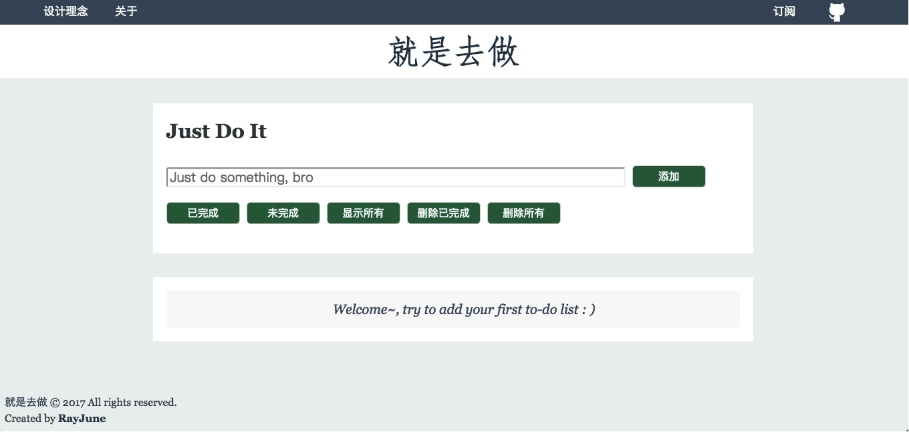
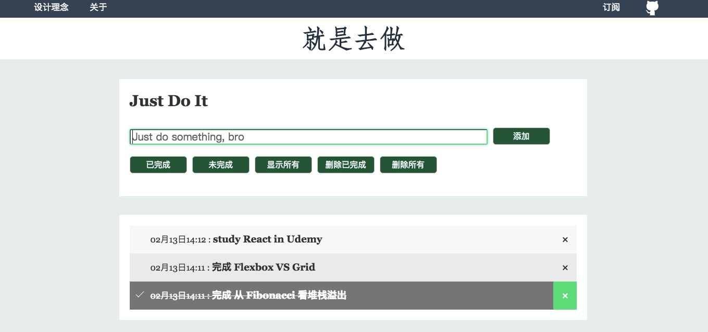
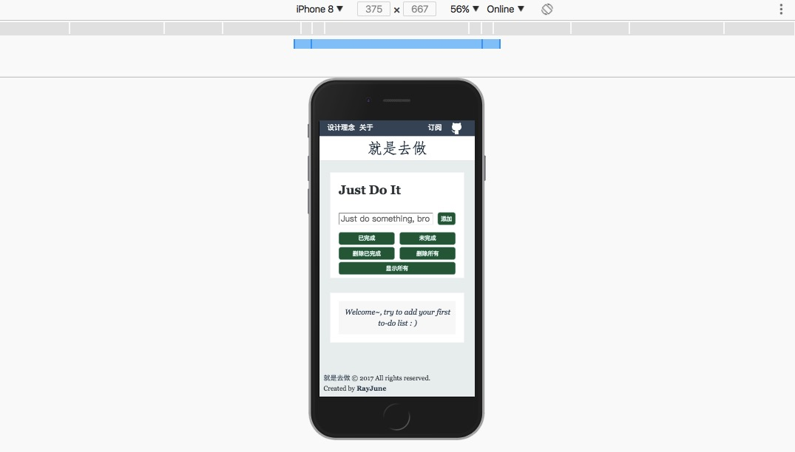

## 一个基于 indexedDB、plain JavaScript 实现的 toDoList web-app

### 就是去做

#### 首页

#### 添加 item

#### 随机名言警句

#### 针对 mobile 进行优化

### 主要功能

* 使用 indexedDB 提供存储 todolist item 和随机出现的名言警句（用自己的 [indexeddb-crud](https://www.npmjs.com/package/indexeddb-crud) package 来操作 indexedDB）
* 如果用户的浏览器不支持 indexedDB 则自动转换为 without indexedDB mode（[这部分代码利用 lazy load 的方式来加载](https://github.com/RayJune/JustToDo/blob/gh-pages/src/scripts/utlis/lazyLoadWithoutDB.js)）
* 列表 item 为空则随机出现名言警句

### branch 状况

* gh-pages 放置最新代码的更新（默认分支，可运行）
* dev 放置测试代码的更新（不一定可运行）
* ES5 分支放置 ES5 的代码实现（我不会告诉你前 109 次 commit 都是纯 ES5 写的 ：》）

### punchline

* 不借助任何库（包括 JQuery），基于 plain JavaScript 的代码实现（约 1k 行历经多次重构的 JavaScript，前期用 ES5，后期用 ES6 重写，分离出了 ES5 分支来记录老版代码）
* 将操作 indexedDB 的代码部分独立抽出成为一个 npm package，并发布在 npmjs.com 上（用以解决这一类问题）：https://www.npmjs.com/package/indexeddb-crud
* 选择使用 npm scripts 配合 browserify 进行模块化打包
* 使用 handlebars 将 view 和 data 分离，提高代码可维护性，提高页面渲染速度
* 统一的代码风格（ESlint, AirBnB），代码品味（体现在每一行代码的处理中）

### 页面设计理念

整体样式模仿于[前端观察](https://www.qianduan.net)

### 感谢

* [Garrik-Liu的todolist](https://github.com/Garrik-Liu/practises-web/tree/master/cases/12.toDoList)
* [Liugq5713的todolist](https://github.com/Liugq5713/Todolist)

参考/模仿了两位 first commit 的代码，向两位表示感谢：）
